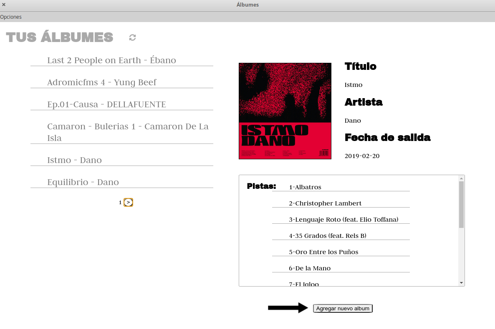
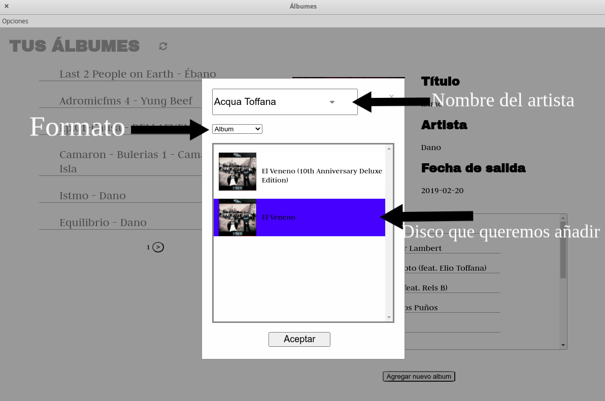
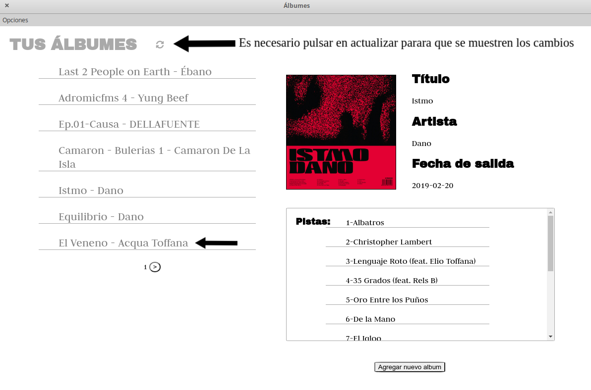
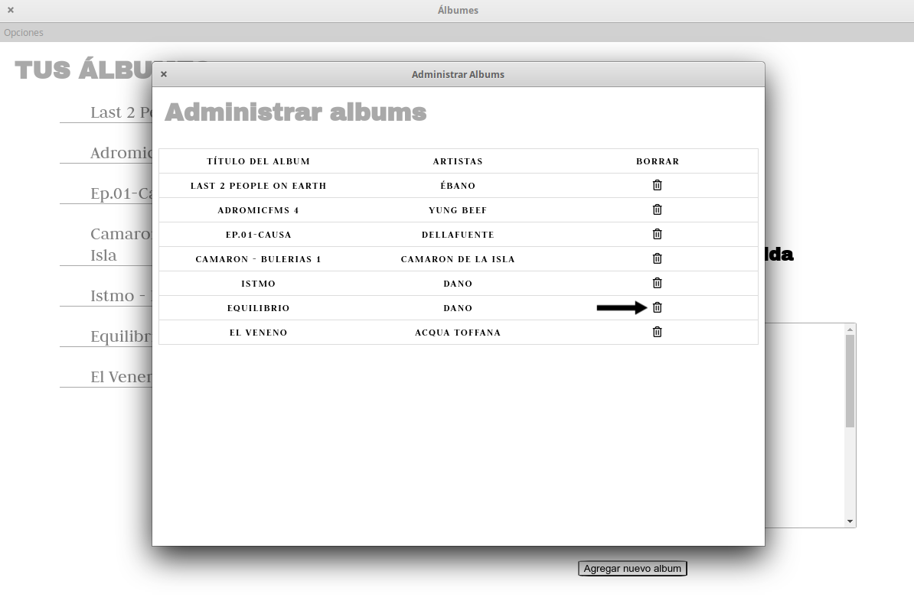
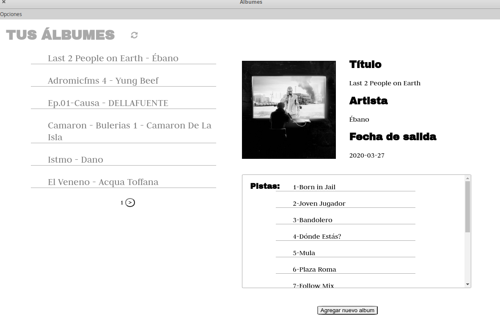

# Music Library Organizer

### Tecnología utilizada
  - Se comunica con la API de Spotify gracias a [spotify-web-api-node](https://github.com/thelinmichael/spotify-web-api-node)
  - Utiliza [Electron-db](https://github.com/alexiusacademia/electron-db), una librería que opera con archivos JSON para almacenar datos.
  - Aplicación construida con [Electron](https://www.electronjs.org/) 

### Pre-requisitos
  - Tener instalado [npm](https://www.npmjs.com/)
  - Tener instalado [node.js](https://nodejs.org/es/)
  - Crear una carpeta "databases" dentro de src/db/

### Puesta en marcha

Abrir en el terminal la carpeta e instalar las dependencias:
```sh
$ npm i
```
Tras instalar las dependencias ejecutamos:

```sh
$ npm run start
```
y la aplicación se iniciará.
### Utilización

Para utilizar la aplicación deberás iniciar sesión con tu cuenta de Spotify.
Para agregar el primer álbum, una vez iniciada la sesión, deberas darle al botón 'Agregar nuevo álbum'


Introducimos el nombre del artista del álbum que queramos añadir y pulsamos sobre la lupa.
También se deberá introducir el formato. Luego seleccionaremos el disco que queramos añadir y pulsamos aceptar.


La ventana se cerrará, recargamos la lista y aparecerá nuestro disco. También se añadirá en tu biblioteca de Spotify
captura3 y captura6 

Para borrar un disco vamos a Opciones > Administrar Álbumes y pulsamos la papelera para el que queramos eliminar de la base de datos


Cerramos la ventana emergente, pulsamos en recargar y el álbum habrá desaparecido



